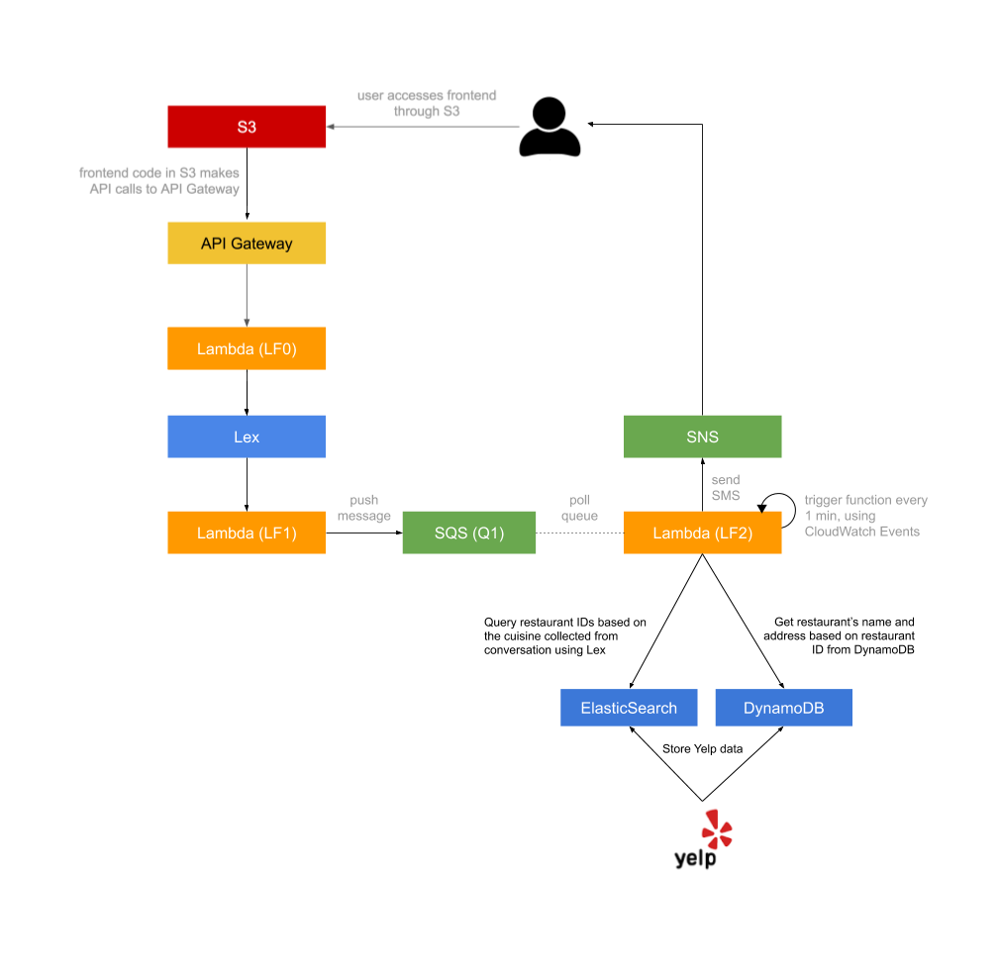

# HW1 - Dining Concierge Chatbot

## Structure

## Repository layout
* **api-spec**: API specifications. Include swagger yaml and the generated html doc.
* **hw1-apihandler**: LF0, the lambda function to handle API requests.
* **frontend**: The website hosted on Amazon S3.
* **es_and_db**: Lambda functions for Elastic Search and DynamoDB.
* **Lex**: Lambda functions for Amazon Lex.
* **sqs_sns**: Lambda functions for Amazon SQS and SNS.

